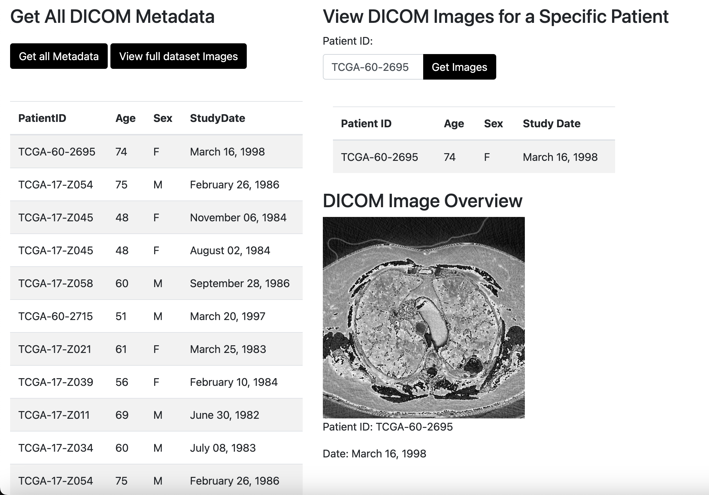

# DICOM API to display DICOM files images and metadata

### JSON Rest API

The app provides raw json data via the routes:

- /api/  ( Metadata of all the patients in the dicom dataset )
- /api/patient/{patient_id} ( Route to get metadata of a patient in JSON format )

The app provides FHIR data via the routes:

- /apifhir ( Route to get DICOM metadata in FHIR format )

### How the app works

- save your dicom encoded data in the dicom folder
- run the dicom_to_img.py file
- after the processing is complete the user can use the API and interface
- accessing different routes allows the user to get more detailed info about the data

### The HTML views

- The overview you get when the app is loaded
  

